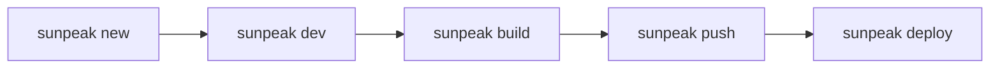

## Overview

The sunpeak CLI commands support a complete development lifecycle, from project creation to production deployment. This page explains how the commands work together.

## Development Lifecycle



### 1. Create

Start a new project with `sunpeak new`:

```bash
pnpm dlx sunpeak new
```

This scaffolds a complete sunpeak project with all the configuration and structure you need.

### 2. Develop

Run the development server with hot reload:

```bash
sunpeak dev
```

This starts the ChatGPT simulator at `http://localhost:6767`, letting you iterate quickly on your App UI.

For testing with the real ChatGPT, start the MCP server:

```bash
sunpeak mcp
```

### 3. Build

Create production-ready bundles:

```bash
sunpeak build
```

This compiles and optimizes your Resources for deployment.

### 4. Push

Push your built Resources to the sunpeak repository:

```bash
sunpeak login        # Authenticate (once)
sunpeak push         # Push to repository
sunpeak push --tag v1.0.0  # Push with version tag
```

Tags let you version your builds and reference specific versions later.

### 5. Deploy

Deploy to production:

```bash
sunpeak deploy
```

This is equivalent to `sunpeak push --tag prod`, marking the current build as the production version.

## CI/CD Integration

The push/pull commands enable CI/CD workflows where your MCP server can pull the latest Resources without rebuilding:

```bash
# In your MCP server deployment:
sunpeak pull -r my-repo -t prod
```

## Dive Deeper

<Card horizontal title="CLI API Reference" icon="terminal" href="/api-reference/cli/new">
  Detailed documentation for all CLI commands and options.
</Card>
